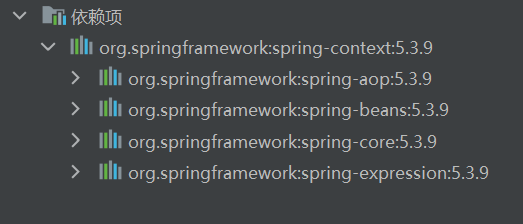

## 引入包

```xml
<dependencies>
    <dependency>
        <groupId>org.springframework</groupId>
        <artifactId>spring-context</artifactId>
        <version>5.3.9</version>
    </dependency>
</dependencies>
<!-- 我们下图可以看到，包含了4个重要部件-->
```




## 创建测试示例

### 创建service层和dao层的接口和实现类，并且创建一个名为BeanFactoryTest的测试类


### 创建配置文件beans.xml

```xml
<?xml version="1.0" encoding="UTF-8"?>
<beans xmlns="http://www.springframework.org/schema/beans"
       xmlns:xsi="http://www.w3.org/2001/XMLSchema-instance"
       xsi:schemaLocation="http://www.springframework.org/schema/beans http://www.springframework.org/schema/beans/spring-beans.xsd">

    <bean id="userService" class="com.cloud.service.impl.UserServiceImpl">
        <!--如果需要在service中引用dao，就下面这样子写-->
        <!--name为去掉set的方法名，ref为需要引用的类，就是下面的userDao-->
        <property name="xxx" ref="userDao"></property>
    </bean>
    <bean id="userDao" class="com.cloud.dao.impl.UserDaoImpl"></bean>
</beans>
```

### 在Service实现类中引用dao的实现类

```java
public class UserServiceImpl implements UserService {

    private UserDao userDao;

    // beanfactory去调用该方法，从容器中获得userDao设置到此处
    // 方法名必须为set... 然后上面的name就是去掉set之后开头小写
    public void setXxx(UserDao userDao) {
        System.out.println("引用 " + userDao);
        this.userDao = userDao;
    }

}
```

### 在测试类中进行测试

```java
public class BeanFactoryTest {
    public static void main(String[] args) {
        // 创建一个工厂对象
        DefaultListableBeanFactory beanFactory = new DefaultListableBeanFactory();
        // 创建一个读取器
        // 读取器和工厂绑定
        XmlBeanDefinitionReader reader = new XmlBeanDefinitionReader(beanFactory);
        // 读取xml文件
        reader.loadBeanDefinitions("beans.xml");
        // 根据id获取bean对象
        UserService userService = (UserService) beanFactory.getBean("userService");
        // 输出结果 【引用 com.cloud.dao.impl.UserDaoImpl@26ba2a48】
    }
}
```

