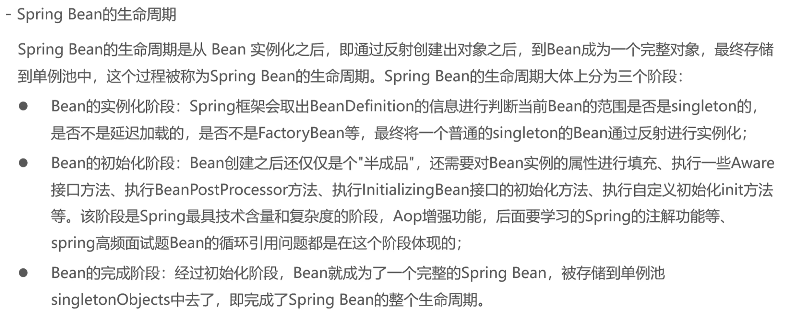
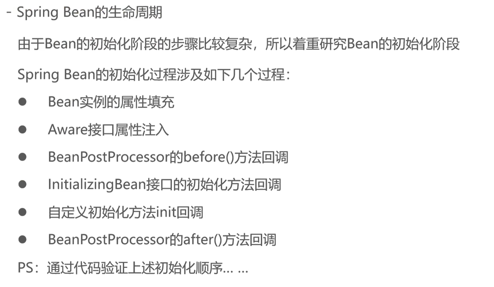
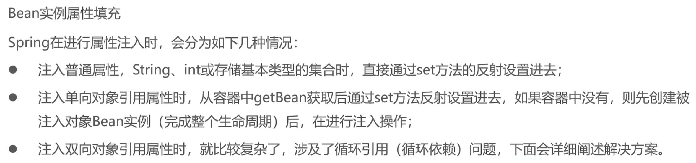

### 单向注入

还是之前那一套代码

```xml
<bean id="userService" class="com.cloud.service.impl.UserServiceImpl">
    <property name="userDao" ref="userDao"/>
</bean>
<bean id="userDao" class="com.cloud.dao.impl.UserDaoImpl"/>
------------------------------------------
结果是
service无参构造
dao的无参构造
service注入dao
```

如果说先创建的是service，但是service需要注入dao，那么内部会先停一下，去把dao先创建出来，然后再注入给service

我们看下面这个例子，就很好理解了，我们新加一个controller

```xml
<bean id="userService" class="com.cloud.service.impl.UserServiceImpl">
    <property name="userDao" ref="userDao"/>
</bean>
<bean class="com.cloud.controller.UserController"/>
<bean id="userDao" class="com.cloud.dao.impl.UserDaoImpl"/>
------------------------------------------------------
service无参构造
dao的无参构造
service注入dao
controller无参构造
```

可以看到，明明是controller先来的，但是先创建dao


### 循环引用

说白了就是这样子

```xml
<bean id="userService" class="com.cloud.service.impl.UserServiceImpl">
    <property name="userDao" ref="userDao"/>
</bean>
<bean id="userDao" class="com.cloud.dao.impl.UserDaoImpl">
    <property name="userService" ref="userService"/>
</bean>
```

如何解决？

Spring提供了三级缓存存储完整的Bean和半成品Bean实例，用于解决循环引用的问题

在DefaultListableBeanFactory的上四级父类DefaultSingletonBeanRegistry中提供了如下三个Map

```java
public class DefaultSingletonBeanRegistry extends SimpleAliasRegistry implements SingletonBeanRegistry {

   // 1. 最终存储单例Bean成品的容器，即实例化和初始化都完成的Bean，称为一级缓存
   private final Map<String, Object> singletonObjects = new ConcurrentHashMap<>(256);

   // 2. 早期Bean单例池，缓存半成品对象，且当前对象已经被其他对象引用了，称之为二级缓存
   private final Map<String, Object> earlySingletonObjects = new ConcurrentHashMap<>(16);

   // 3. 单例Bean的工厂池，缓存半成品对象，对象未被引用，使用时再通过工厂创建Bean，称之为三级缓存
    private final Map<String, ObjectFactory<?>> singletonFactories = new HashMap<>(16);
}
```


首先注意一下，存入三级缓存的对象是ObjectFactory这个类，例如你的Bean是UserDao，那么存储到三级缓存的是ObjectFactory\<UserDao>这个类，给你封装了一层

```java
@FunctionalInterface
public interface ObjectFactory<T> {
	T getObject() throws BeansException;
}
```


假如是先创建service

我们创建了service，进行了实例化，实例化之后先存入三级缓存，然后去给service进行初始化，填充dao，然后Spring就会去一二三级缓存全部查一遍，去找dao，这里很明显，找不到

那么就会先去创建dao，实例化dao，先存入三级缓存，然后去初始化，填充service，从一二三级缓存中找有没有service，这里可以从三级缓存里找到service，然后dao创建成功，存入二级缓存，然后dao继续执行其他生命周期过程，最后完成了一个Bean，存入一级缓存，删除二三级缓存，然后返回到service继续执行

service这时候再找，能从一级缓存里找到dao，注入，也一样存入二级缓存，执行其他生命周期，存入一级缓存，删除二三级缓存


### 常用的Aware接口


就举这么个例子吧，假如你想要获取BeanName，这个是不是在xml中设置的？

那么我在编写这个Bean的时候，想要获取BeanName，是不是没有办法获取到？

就好像是先有鸡才有蛋的感觉，我需要先编写Bean，然后再去配置Spring，但是我在Bean中想要获取Spring配置的BeanName

这时候我们就可以用Aware接口，具体就是你需要的那个Bean去实现对应的Aware接口

```java
public class UserServiceImpl implements UserService, BeanNameAware {

    @Override
    public void setBeanName(String name) {
        System.out.println("BeanNameAware " + name);
    }
}
// ------------------------------------------------------------
BeanNameAware userService
```

这玩意在实际开发中使用的并不多，但是很多框架都采用了这种接口模式，因此还是很有必要了解一下的