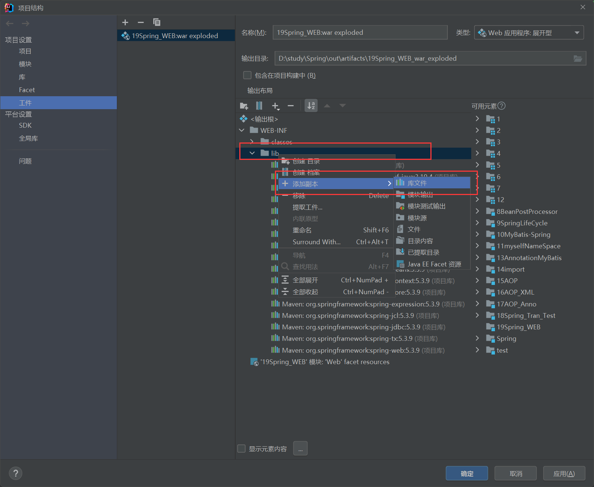
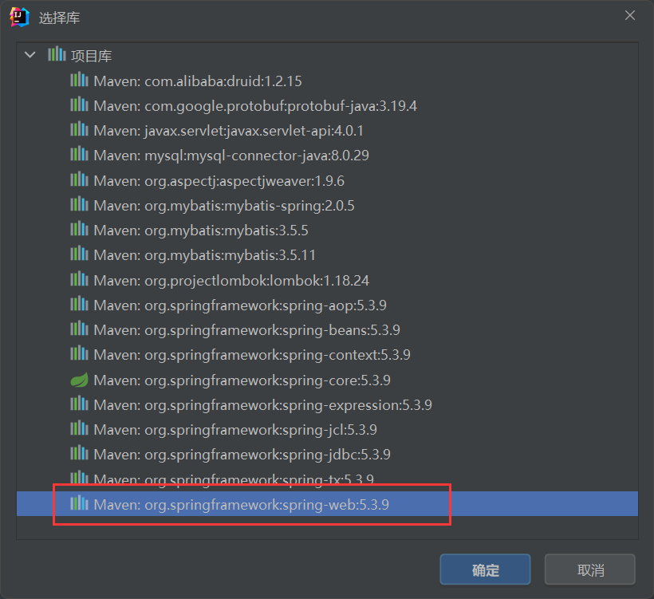

## 引包

```xml
<dependency>
    <groupId>org.springframework</groupId>
    <artifactId>spring-web</artifactId>
    <version>5.3.7</version>
</dependency>
```

## xml配置

### web.xml

```xml
<!-- 配置Listener -->
<listener>
    <listener-class>org.springframework.web.context.ContextLoaderListener</listener-class>
</listener>
<!-- 定义全局参数 -->
<context-param>
    <param-name>contextConfigLocation</param-name>
    <param-value>classpath:applicationContext.xml</param-value>
</context-param>
```

然后在web层中的AccountServlet的WebApplicationContextUtils类改成Spring-web提供的工具类

```java
import com.cloud.service.AccountService;
import org.springframework.context.ApplicationContext;
import org.springframework.web.context.support.WebApplicationContextUtils;

import javax.servlet.*;
import javax.servlet.http.*;
import javax.servlet.annotation.*;
import java.io.IOException;

@WebServlet(urlPatterns = "/accountServlet")
public class AccountServlet extends HttpServlet {
    @Override
    protected void doGet(HttpServletRequest request, HttpServletResponse response) throws ServletException, IOException {
        ServletContext servletContext = request.getServletContext();
        ApplicationContext applicationContext = WebApplicationContextUtils.getWebApplicationContext(servletContext);
        AccountService bean = applicationContext.getBean(AccountService.class);
        bean.transferMoney("tom", "lucy", 500);
    }
}
```

其他的和之前的一样

### 可能遇到的问题

```java
org.apache.catalina.core.StandardContext.startInternal 一个或多个listeners启动失败，更多详细信息查看对应的容器日志文件
```

那么可能是包没有导入



然后选中spring-web，加入到库中就没有问题了




## SpringConfig配置

### MyAnnotationConfigWebApplicationContext

```java
public class MyAnnotationConfigWebApplicationContext extends AnnotationConfigWebApplicationContext {

    public MyAnnotationConfigWebApplicationContext() {
        super();
        this.register(SpringConfig.class);
    }

}
```

### web.xml

```xml
<!-- 定义全局参数 -->
<context-param>
    <param-name>contextClass</param-name>
    <param-value>com.cloud.config.MyAnnotationConfigWebApplicationContext</param-value>
</context-param>
<!-- 配置Listener -->
<listener>
    <listener-class>org.springframework.web.context.ContextLoaderListener</listener-class>
</listener>
```

其他的一致